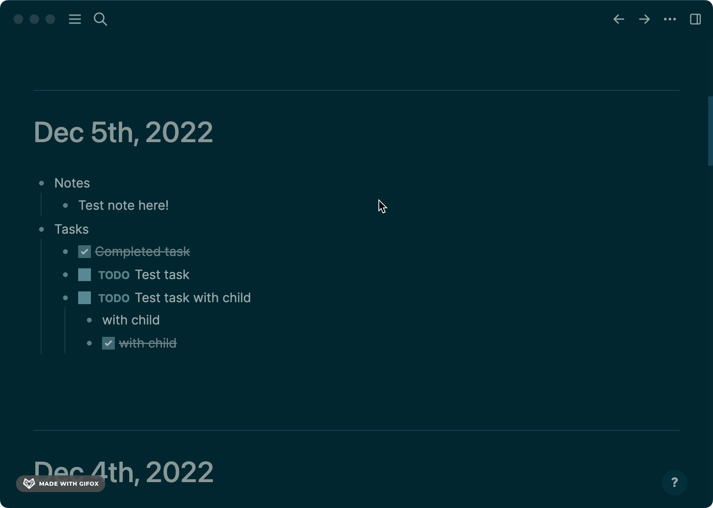

# Logseq Journal Auto Copier Plugin

  

Created by: [Alec Dibble](https://www.alecdibble.com)

## Functionality

* Copies last filled out journal to today's journal

* Deletes any completed tasks

* Deletes any children of blocks that contain the string "Notes"

* Runs every minute, won't run if today's note already has content

  

## Developing

* If you have a feature suggestion or bug fix, feel free to submit a PR

* To build: `npm install && npm run build`

* To run:
     1. Follow the instructions above to build

     2. Enable Developer Mode in Logseq

     3. Click `Plugins` -> `Load Unpacked Plugin` and select this repo's folder

## Change Log

* **1.1.0**
  * Added error handling
  * Added better UI messaging
  * Upgraded Logseq library version

* **1.0.0**
  * Initial release